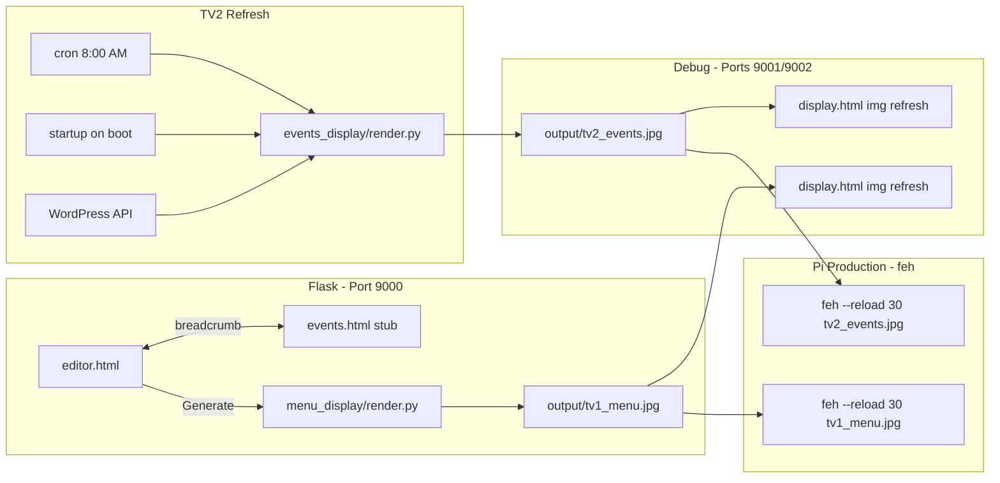

# cdr_mtn_tv — Architecture Plan

## Goal

Single-use Raspberry Pi 4 dual-HDMI display system:

- **TV1 (1920×1080 landscape):** Editable draft/food menu → static JPG
- **TV2 (1920×1080 after −90° rotation):** This Week / Upcoming events poster from WordPress API
- **Debug mode:** Three browser windows on ports 9000/9001/9002
- **Future:** Streamed-events actions on `/events` page (stub in v1)

## Architecture

## Design Decisions

| Decision | Choice |
|----------|--------|
| Pi TV display | feh fullscreen with `--reload 30` |
| Debug TV display | Minimal display.html with cache-busted img |
| Flask concurrency | No threads — subprocess launcher for debug |
| Web UI | Separate editor.html + events.html with breadcrumb |
| TV2 refresh | Cron 8 AM + startup refresh on boot |
| Pi setup | Idempotent install_pi.sh |
| Config | menu_groups + menu_columns width_percent |
| Chromium | Optional fallback only |

## Display Refresh

| Context | Mechanism |
|---------|-----------|
| Pi feh | `--reload 30` detects JPG mtime change |
| Debug browser | JS setInterval reloads img with `?t=timestamp` |

No WebSockets, no Flask threads, no push notifications.

## Non-Goals (v1)

- Authentication
- Multi-tenant / reusable framework
- Dynamic HTML menus on TVs
- Streamed-events actions (stub only)
